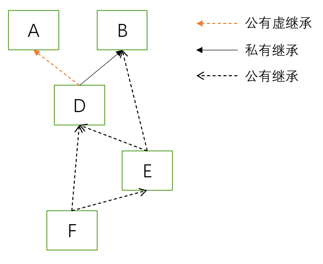
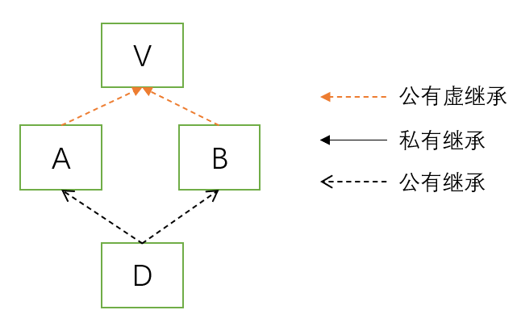

# c++ primer plus中对RTTI的描述

## 综述

RTTI: Runtime type identification，运行时类型检测

目的：The intent of RTTI is to **provide a standard way** for a program to determine the type of object during runtime.


RTTI如何工作：

由三个部分支撑：

* `dynamic_cast`运算符：如果可能`dynamic_cast`将一个指向基类类型的指针转化为指向之类类型的指针。如果这种装换无法完成，返回`nullptr`
* `typeid`运算符：返回描述一个实例的类型的值
* `type_info`结构体：描述某个类型的信息

注：只能将RTTI用于拥有虚函数的继承体系。理由：只有在拥有虚函数的继承体系下，将子类实例的地址赋给基类指针才是有意义的。


## `dynamic_cast`运算符

虽然该`dynamic_cast`不会告诉我们一个指针指向的实例的类型，但它会回答我们是否能安全地将一个实例的地址赋给某个类型的指针的问题。值得注意的是，判断一个类型转换是否安全比精确获取实例类型更为广泛和有用。因为我们希望获取实例类型的原因在于我们想知道调用一个函数是不是可行的。


### 指针形式

语法：

```c++
// pt is a pointer pointing to an object
Type *pm = dynamic_cast<Type*>(pt);
```

如果`*pt`实例是`Type`类型或者是其直接或间接子类，上述语句将`pt`转化为一个`Type*`类型的指针，否则，返回`nullptr`。

`dynamic_cast`主要用于向下转型，即：从基类到子类的类型转换。


**注：**只有在拥有**虚函数**继承体系中才能使用`dynamic_cast`，因为`dynamic_cast`依赖**虚函数表**工作。

例如下述代码会报错：`E0698：运行时 dynamic_cast 的操作数必须包含多态类型`

```c++
class Base {};
class Sub : public Base {};

//main
Base* pSub = new Sub;
Sub* pCast = dynamic_cast<Sub*>(pSub); // E0698
```

*在拥有虚函数的继承体系*，更进一步，指的是`dynamic_cast`的目标、源都需要具有**虚函数表**，否侧`dynamic_cast`不会正常工作。例如：

```c++
class Base {
public:
	virtual void fun() {}
};
class Sub : public Base {};
class BadGuy {};

//main
BadGuy* pB = new BadGuy;
Base* pD = dynamic_cast<Base*>(pB); // E0698
```

但上述代码第6行若改为

```c++
class BadGuy {
public:
    virtual void bad(){}
};
```

编译时不会提示任何错误，运行时`dynamic_cast<Base*>(pB);`的值为`nullptr`，符合我们的预期。


虽然有这些比较麻烦的设置，但情况还不是非常严峻，编译器能够给我们非常确切的提示。

但如果将`reinterpret_cast`也牵扯进来，事情就复杂起来了，见如下代码：

```c++
class Base {
public:
	virtual void fun() {}
};

class Sub : public Base {};

class NotThatBad {
public:
	virtual void fun() {}
};
class BadGuy {};

//main
// case 1
NotThatBad* pNTB = new NotThatBad;
Base* pBase1 = reinterpret_cast<Base*>(pNTB);
Sub* pSub1 = dynamic_cast<Sub*>(pBase1); //pSub1 = nullptr

// case 2
BadGuy* pBad = new BadGuy;
Base* pBase2 = reinterpret_cast<Base*>(pBad);
Sub* pSub2 = dynamic_cast<Sub*>(pBase2); // Runtime Error
```

`case 1`虽然进行了危险`reinterpret_cast`跨继承进行转换，但是`dynamic_cast`仍然正常执行了，毕竟`NotThatBad`类型实例具有虚函数表，能支持`dynamic_cast`的工作。

但`case 2`在运行时出现内存错误，这是因为`BadGuy`类型实例不具备虚函数表，当`dynamic_cast`尝试通过虚函数表获取指针指向实例的类型时便触发内存错误。


### 引用形式

`dynamic_cast`也可以作用于引用，与指针形式稍有区别，因为不存在空的引用，所以当`dynamic_cast`转换失败时将抛出`bad_cast`异常。

`bad_cast`继承自`exception`且在`typeinfo`头文件中定义(有趣的是我们很容易间接引入`bad_cast`，因为`iostream`头文件间接包含了`bad_cast`)。

所以，参考代码如下：

```c++
#include <typeinfo>
...
try{
    // suppose rg is of type: TypeB&
    TypeA& ra = dynamic_cast<TypeA&>(rg);
}catch(bad_cast& ){
    
}
```


# ISO 14882 对dynamic_cast的描述

## 定义部分

> P125 8.2.7 Dynamic cast

1. 表达式(expression)`dynamic_cast<T>(v)`的结果是将表达式`v`转化为类型(type)`T`。`T`应该是指向一个完整类型(complete class type)的指针或者引用，或者是可能有`const`和`violate`修饰的`void`类型指针(pointer to cv void)。`dynamic_cast`不会擦除常量性(constness)。

2. 如果`T`是指针类型，则`v`应该是一个指向完整类型的纯右值(prvalue)指针，且转化结果是类型为`T`的纯右值变量。如果`T`是左值引用(lvalue reference)类型，则`v`应该是一个完整类型的左值(lvalue)，且转化结果是由`T`指定类型的左值。如果`T`是右值引用(rvalue reference)类型，则`v`应该是拥有完整类型的泛左值，且转化结果是由`T`指定类型的消亡值(xvalue)。

3. 如果`v`的类型和`T`类型相同，或仅`T`的类型比`v`的类型多了cv限定符(cv-qualifier)，转化结果为`v`。(如果必要将进行转换)

4. 如果`v`的是指针且为空指针(null pointer)，转化结果为`T`类型的空指针。

5. 假设`T`为`pointer to cv1 B`(`cv1 B`类型的指针)，`v`类型为`pointer to cv2 D`(`cv2 D`类型的指针)，其中`B`是`D`的基类，`cv1`、`cv2`表示不同的两个cv限定符，转化结果为指向由`v`指向的`D`对象的唯一`B`类型子对象的指针。相似的，如果`T`是`cv1 B`类型的引用，`v`类型为`cv2 D`，其中`B`是`D`的基类，转化结果为由`v`指定的`D`对象的唯一`B`类型对象的引用。在上述两个情况中，如果`cv2`限制等级比`cv1`高或者`B`是`D`的不可访问或有歧义基类，这部分代码是不规范的(ill-formed)。例如：

   ```c++
   struct B{};
   struct D:B{};
   void foo(D* dp){
       B* bp = dynamic_cast<B*>(dp); // equivalent to B* bp = dp;
   }
   ```

   > 译注：
   >
   > 这里需要区分**子类**和**子对象**的区别。类是 `class type` 是一种静态结构，用于描述对象中储存数据的结构和行为；对象是 `object` 是类在内存中的具体表示，是动态可变的。
   >
   > 从静态结构上看，子类包含父类所有功能，即 $子类 \supset 父类$。
   >
   > 从内存上看，一个对象的子对象是该对象内存中的一部分，也即是 $子对象 \subset 对象$。

6. 除上述限制外，`v`应该是一个指向多态类型(polymorphic type)的指针或多态类型的泛左值。

7. 如果`T`是`void`类型的指针(无论是否有cv限定符)，则转化结果指向v指向的对象，且类型为v对象的最大派生对象(most derived object pointed to by v)。除此之外，`dynamic_cast`会在运行时(runtime)检测指针或引用`v`代表的对象能否转化为`T`确定的指针类型或引用类型。

8. 如果`C`是`T`指向或引用的类型，运行时检测按照下述逻辑执行：

   1. 如果在v指向(引用到)的最大派生对象中，v指向(引用至)一个C对象的公共基类字对象(a public base class subobject of a C object)，且仅当`v`指向的子对象只派生出唯一的`C`类型对象，则转化结果指向(引用至)那个C对象。
   2. 除上述情况，如果v指向(引用至)最大派生对象的一个公共基类对象，并且最大派生对象拥有一个无歧义公共C类型基类，转化结果指向(引用至)最大派生对象的C类型字对象。
   3. 除上述情况，转化失败。
   
9. 关于指针的失败转化的结果是一个转化目标类型的空指针。一个失败的对引用的转化将会抛出`std::bad_cast`类型的异常。例：

   ```c++
   class A {virtual void f();}
   class B {virtual void g();}
   class D : public virtual A, private B {};
   void foo(){
       D d;
       B* bp = (B*)&d; // 需要强制转换来打破访问保护
       A* ap = &d;		// 公有继承，不需要装换
       
       D& dr = dynamic_cast<D&>(*bp); 
       // 失败，bp指向的对象类型为B，bp指向的最大派生对象类型为D，bp指向对象是D的私有基类类型，不满足 8.a 条件。
       
       ap = dynamic_cast<A*>(bp);	// 失败，原因基本同上，B是D的私有基类
       bp = dynamic_cast<B*>(ap);	// 失败，同上
       ap = dynamic_cast<A*>(&d); 	// 成功
       bp = dynamic_cast<B*>(&d); 	// 非规范行为，无运行时检测。
   }
   
   class E : public D, public B {};
   class F : public E, public D {};
   void bar(){
       F f;
       A* ap  = &f; 					// 成功
       D* dp  = dynamic_cast<D*>(ap);	// 失败，f具有两个D子对象
       E* ep1 = dynamic_cast<E*>(ap);	// 成功
       E* ep  = (E*)ap;				// 非规范行为：从虚基类转换
   }
   ```

   > 译注：可结合下述继承关系图理解：
   >
   > 

注：`15.7`描述了类还在构造时`dynamic_cast`的行为。


## 其余涉及到`dynamic_cast`的说明

> P40 5.11 Keywords

`dynamic_cast`是保留关键词之一。


> P55 6.2 One-definition rule
>
> 条目 5.6

大概意思是`dynamic_cast`中出现的类型需要有完整定义。


> P87 6.8 Object lifetime
>
> 条目 6.8，条目 7.4

说明在对象的生命周期已经开始但所需内存还未分配或对象生命已经结束但所占内存还未释放时，使用`dynamic_cast`会出现未定义行为(undefined behavior)。


> P121
>
> 条目 1、条目 2

1. 说明`dynamic_cast`是从左到右结合的后缀表达式(postfix-expression)。
2. 在`dynamic_cast`语境下，`>>`被理解为两个`>`而不是右移符号。


> P8.4 Explicit type conversion (cast notation)
>
> 条目2

说明显示类型转换(explicit type conversion)可以用函数式记号(functional notation)、类型转换运算符(dynamic/static/const/reinterpret_cast)或强制装换运算符(cast notation)。


> P308 Initializing bases and members
>
> 条目 17

说明在`15.7`描述了在构造期间调用虚函数(virtual function)、`typeid`和`dynamic_cast`时有良定义(well-defined)的情况，即描述构造期间对象的多态行为。


> P312 15.7 Construction and destruction
>
> 条目 5

在对象构造和析构的时候也可以调用`dynamic_cast`。当`dynamic_cast`在构造函数(包括成员构造函数(mem-initializer)或非静态数据成员(non-static data member)的默认成员构造函数(default member initializer))、析构函数、或从一个构造函数或析构函数中间接或直接地被调用时，如果`dynamic_cast`的操作数指向(引用至)的对象正在被构造或者析构，这个对象的最大派生对象的类型被视为正在构造或析构的构造函数或析构函数所在类的类型。如果操作数指向的正在构造或析构的对象的静态类型(static type)不是指向构造函数或析构函数所在类型本身或其基类，则`dynamic_cast`的对过是未定义的。例：

```c++
struct V {virtual void f();};
struct A : virtual V {};
struct B : virtual V {B(V*, A*);}
struct D : A, B {
    D(): B((A*)this, this) {}
}

B::B(V* v, A* a){
    typeid(*this);		// B 的 type_info
    typeid(*v);			// 良定义：*v的类型为V，B的一个基返回的是B的type_info
    typeid(*a);			// 未定义：A不是B的一个基类
    dynamic_cast<B*>(v);// 良定义：v类型为V*，V是B的基类，结果类型为B*
    dyanmic_cast<B*>(a);// 未定义：a类型为A*，A不是B的基类
}
```

继承关系图：




> P396 17.6.2.2 Type-dependent expression
>
> 条目 3.8

说明包含`dynamic_cast`的`id-expression`是类型依赖(type-dependent)的。


> P435 18.1 Throwing an exception
>
> 条目 1

说明`dynamic_cast`可能会抛出异常。


> P440 18.4 Exception specifications
>
> 条目 6.4

说明`dynamic_cast`可能会抛出异常。


> P513 21.7.3 Class bad_cast
>
> 条目 1

说明`bad_cast`用于报告失败的`dynamic_cast`


> P518 21.8.7 nested_exception
>
> 条目 2、条目 9

2. 说明可以用`dynamic_cast`带检测`nested_cast`的多态性

9. 对`rethrow_if_nested`的进一步说明


> P522 21.10.4 Signal handlers
>
> 条目 3

说明`dynamic_cast`是信号安全的(singal-safe)


> P639 23.11.2.2.9 shared_ptr cast
>
> 条目 4、条目 5.1

`shared_ptr`的成员函数中使用到了`dynamic_cast`，此时要求`dynamic_cast`相关语句是良定义且规范(well formed)的。且在实现上另一种等价语句将导致未定义行为。


> P648 23.12.2.2 memory_resource private virtual member functions
>
> 条目 7

某一个接口返回值的定义依赖于`dynamic_cast`


> P655 23.12.5.4 Pool resource members
>
> 条目 9、条目 10

在线程安全的内存池的实现中使用到了`dynamic_cast`。


> P657 23.12.6.2 monotonic_buffer_resource members
>
> 条目 10

方法实现时使用了`dynamic_cast`语句。


其余的琐碎的涉及：

P1427 出现在附录A  Grammar summary 中

P1527 出现在索引(Index)中

